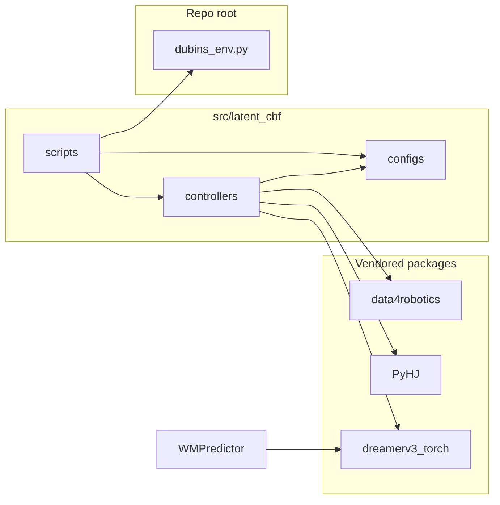

# Architecture review and reorganization plan

**Scope:** Staff-engineering review of the `latent_cbf` repository: maintainability, discoverability, testability, ownership boundaries, and low-migration refactors.

**Tracking:** Implementation checklist at the end; this document is revised when the tree or major coupling points change.

---

## Current repository layout

High-level picture of **this** repo (paths relative to repository root):

```text
latent_cbf/
  README.md                    # command cookbook; paths often omit src/latent_cbf/ prefix
  requirements.txt             # -e dreamerv3_torch, diffusion4robotics, PytorchReachability
  dubins_env.py                # Dubins gym env (single module at root; not under src/)
  docs/
    architecture-reorganization-plan.md
  src/
    latent_cbf/                # primary application code (imported via PYTHONPATH or cwd hacks)
      configs/                 # Config, presets, DreamerConfig, …
      controllers/             # MPC, MPPI, simple, random, diffusion, factory, wm_predictor
      scripts/                 # collect_trajs, run_experiment, dreamer_offline, train_diffusion, …
  diffusion4robotics/          # installable package data4robotics (training, Hydra experiments)
  PytorchReachability/         # installable package PyHJ
  dreamerv3_torch/             # installable package dreamerv3_torch (Dreamer RSSM, tools)
```

**Import model today:** Scripts under `src/latent_cbf/scripts/` typically prepend `src/latent_cbf` (or an equivalent parent) to `sys.path` so that `from configs import …`, `from controllers import …`, and `from dubins_env import …` resolve. There is **no** root `pyproject.toml` installing a `latent_cbf` distribution yet—only the three editable deps in `requirements.txt` plus third-party packages.

---

## Status (as of last revision)

### Done

- **`dreamerv3_torch`:** Installable package ([`dreamerv3_torch/pyproject.toml`](dreamerv3_torch/pyproject.toml)); [`requirements.txt`](requirements.txt) includes `-e ./dreamerv3_torch`. Imports use `dreamerv3_torch.models` / `dreamerv3_torch.tools` without appending a flat `dreamerv3-torch/` folder.
- **`src/latent_cbf` tree:** Core integration code lives under [`src/latent_cbf/`](src/latent_cbf/): [`configs/`](src/latent_cbf/configs/), [`controllers/`](src/latent_cbf/controllers/), [`scripts/`](src/latent_cbf/scripts/).
- **Controller factory:** Single implementation [`src/latent_cbf/controllers/factory.py`](src/latent_cbf/controllers/factory.py) with `create_controller_from_config(config, wm_config=None)`. Callers: [`scripts/run_experiment.py`](src/latent_cbf/scripts/run_experiment.py), [`scripts/collect_trajs.py`](src/latent_cbf/scripts/collect_trajs.py), [`scripts/wm_ddpg.py`](src/latent_cbf/scripts/wm_ddpg.py). Optional **`FilteredDiffusionController`** wrapping is handled inside the factory when `wm_config` is set and `use_wm_prediction` is true.

### Partially done

- **`sys.path` / absolute paths:** Dreamer-specific hacks are largely gone in library code that was updated; **remaining** non-Dreamer issues include:
  - [`src/latent_cbf/controllers/diffusion_controller.py`](src/latent_cbf/controllers/diffusion_controller.py) — hardcoded `/home/kensuke/diffusion4robotics` (should rely on `-e ./diffusion4robotics` only).
  - [`src/latent_cbf/controllers/simple_controller.py`](src/latent_cbf/controllers/simple_controller.py), [`mpc_controller.py`](src/latent_cbf/controllers/mpc_controller.py), [`mppi_controller.py`](src/latent_cbf/controllers/mppi_controller.py) — legacy `/home/kensuke/WM_CBF/...` appends in some paths.
  - Scripts — append repo-root / `src/latent_cbf` for imports; [`wm_ddpg.py`](src/latent_cbf/scripts/wm_ddpg.py) still uses a broken `os.path.join(script_dir, '/PyHJ')` and debug `print(sys.path)`.
- **Packaging:** Vendored stacks are installable; **application** code is not yet a named installable package (no `pip install -e .` for `latent_cbf` itself).

### Not started / open

- **Script hygiene:** [`visualize_trajs.py`](src/latent_cbf/scripts/visualize_trajs.py) (`from collect_trajs import …`), [`eval_dreamer.py`](src/latent_cbf/scripts/eval_dreamer.py) (`from dreamer_offline import Dreamer`) — fragile unless run with matching `cwd`/`PYTHONPATH`.
- **`get_narrow_gap_config`:** Listed in [`configs/__init__.py`](src/latent_cbf/configs/__init__.py) `__all__` but not defined in [`presets.py`](src/latent_cbf/configs/presets.py) or imported; [`run_experiment.compare_configurations`](src/latent_cbf/scripts/run_experiment.py) references it → runtime error if called.
- **Root `dubins_env.py`:** Still at repository root while the rest of the app lives under `src/latent_cbf/` — split ownership / duplicate risk if a second copy appears.
- **Tests:** No `tests/` tree or smoke tests for imports.
- **Trajectory script duplication:** [`src/latent_cbf/scripts/combine_traj_to_buffer_dubins.py`](src/latent_cbf/scripts/combine_traj_to_buffer_dubins.py) vs [`diffusion4robotics/combine_traj_to_buffer.py`](diffusion4robotics/combine_traj_to_buffer.py).
- **Machine-local paths:** `/data/dubins/...` still embedded in presets and dreamer configs.

---

## Current architecture summary

**Shape:** **Hybrid:** artifact-style packages under **`src/latent_cbf/`** (`configs`, `controllers`, `scripts`) plus a **lone** [`dubins_env.py`](dubins_env.py) at repo root, combined with **three installable subtrees** at the root: `diffusion4robotics` (`data4robotics`), `PytorchReachability` (`PyHJ`), `dreamerv3_torch`.

**Dominant data flows:**



**Discoverability:** Root [`README.md`](README.md) lists commands like `python scripts/collect_trajs.py`; on disk, scripts live at **`src/latent_cbf/scripts/`** unless the project adds wrappers or `pip` console entry points—contributors should set **`PYTHONPATH=src/latent_cbf`** (or equivalent) when running from the repo root.

**Testability:** Still no automated tests; behavior is validated by running scripts.

**Ownership boundaries:** (1) Dubins sim + configs + controllers + scripts, (2) diffusion BC training in `diffusion4robotics`, (3) PyHJ + Dreamer in reachability / WM scripts. Coupling remains high in [`diffusion_controller.py`](src/latent_cbf/controllers/diffusion_controller.py) (data4robotics + dreamerv3_torch + PyHJ).

---

## Target direction (remaining work)

**Original goal** — a **single installable `latent_cbf` package** with `src/latent_cbf/...` as the import root — is **partially realized** (tree exists; installable metadata and shims do not).

**Suggested next layout (incremental):**

```text
latent_cbf/
  pyproject.toml               # NEW: package latent_cbf from src/latent_cbf (or flat layout)
  src/
    latent_cbf/
      dubins/                  # move dubins_env.py here; thin shim at root optional
      configs/
      controllers/
      orchestration/           # optional: extract run_episode / run_experiment core
      scripts/                 # or cli/ + entry_points in pyproject.toml
  diffusion4robotics/
  PytorchReachability/
  dreamerv3_torch/
```

**Principles (unchanged):** feature-oriented modules inside `latent_cbf`; avoid a giant shared `utils/`; keep Hydra training config under `diffusion4robotics/experiments/` unless you intentionally centralize.

---

## Anti-patterns observed

| Issue | Where | Impact | Status |
|-------|--------|--------|--------|
| Duplicate controller wiring | Previously `run_experiment` vs `factory` | Drift | **Resolved** — single [`factory.py`](src/latent_cbf/controllers/factory.py) |
| `sys.path` / hardcoded paths (non-Dreamer) | `diffusion_controller.py`, MPC/MPPI/simple | Brittle installs | **Open** |
| Script `sys.path` hacks | Dreamer scripts, `collect_trajs`, `wm_ddpg` | Fragile runs | **Open** |
| Broken PyHJ join + debug print | `wm_ddpg.py` | Wrong path noise | **Open** |
| Script-to-script imports | `eval_dreamer`, `visualize_trajs` | CWD failures | **Open** |
| God module | `diffusion_controller.py` | Hard to test | **Open** |
| Machine-specific paths | presets, `dreamer_conf` | Portability | **Open** |
| `get_narrow_gap_config` | `__all__` / `compare_configurations` | Broken API | **Open** |
| Duplicate trajectory converters | scripts vs `diffusion4robotics` | Confusion | **Open** |
| Non-package Dreamer | — | — | **Resolved** (`dreamerv3_torch`) |

**Circular imports:** No tight cycle between `configs`, `controllers`, and `dubins_env` at import time. **Hidden coupling** remains via path hacks and `diffusion_controller` importing multiple stacks.

**Utilities:** `data4robotics/data4robotics/misc.py` is training/job glue (Hydra, WandB); name is generic but location is correct for that subpackage.

---

## Proposed changes (tracked items)

| # | Topic | Status |
|---|--------|--------|
| 1 | `dreamerv3_torch` packaging | **Done** |
| 2 | Remove non-Dreamer `sys.path` / absolute paths in controllers | **Partial** |
| 3 | Single `create_controller_from_config` | **Done** (factory + callers) |
| 4 | Script import hygiene (`visualize_trajs`, `eval_dreamer`) | **Open** |
| 5 | Installable `latent_cbf` package + optional move `dubins_env` into `src/latent_cbf/dubins/` | **Partial** (tree only) |
| 6 | `get_narrow_gap_config` or remove from `__all__` / demos | **Open** |
| 7 | Externalize `/data/...` defaults | **Open** |
| 8 | Rename `data4robotics.misc` (optional) | **Open** |
| 9 | Unify combine-traj scripts | **Open** |
| 10 | Smoke / unit tests | **Open** |

---

## Controller factory (reference — implemented)

Implementation lives in [`src/latent_cbf/controllers/factory.py`](src/latent_cbf/controllers/factory.py):

- Branches: `mpc`, `random`, `mppi`, `diffusion` / `diffusion_wm`, default `simple`.
- `config.max_angular_velocity` used where applicable; MPC/MPPI fields use `getattr` for preset-added attributes.
- `diffusion` / `diffusion_wm`: build `DiffusionController`, then wrap with `FilteredDiffusionController` when `wm_config` is provided and `use_wm_prediction` is true.

Call sites: [`run_experiment.py`](src/latent_cbf/scripts/run_experiment.py), [`collect_trajs.py`](src/latent_cbf/scripts/collect_trajs.py), [`wm_ddpg.py`](src/latent_cbf/scripts/wm_ddpg.py).

---

## What should stay as-is (near term)

- **`data4robotics` package name** and Hydra YAML under `diffusion4robotics/experiments/`.
- **PyHJ** layout under `PytorchReachability/`.
- **Dreamer** as `dreamerv3_torch` unless you fork upstream naming.

---

## Migration sequence (remaining)

1. ~~Dreamer packaging~~ — **done.**
2. ~~Unify controller factory~~ — **done.**
3. Fix **`get_narrow_gap_config`** (implement or remove references).
4. Add **root `pyproject.toml`** (or equivalent) so `pip install -e .` exposes `latent_cbf`; then reduce `sys.path` in scripts.
5. Move **`dubins_env`** into `src/latent_cbf/dubins/` with optional root shim, or re-export from package.
6. Normalize **script imports** and README command paths.
7. Remove temporary **shims** once imports are stable.

---

## Phased plan (updated)

### Phase 1 — Coupling and hygiene

- Strip remaining **absolute** `sys.path` in controllers; fix **`wm_ddpg`** PyHJ path.
- Fix **`get_narrow_gap_config`** / **`__all__`**.
- Add **minimal smoke tests** (import `factory`, construct configs without GPU).

### Phase 2 — Packaging and layout

- **`pyproject.toml`** at repo root for installable **`latent_cbf`**.
- Consolidate **`dubins_env`** under `src/latent_cbf/`.
- Fix **README** paths vs `src/latent_cbf/scripts/`.
- Externalize **`/data/...`** via env or gitignored overrides.

### Phase 3 — Deeper refactors

- Split **`DiffusionController`** (loading vs inference vs WM filter).
- Unify **combine-traj** entrypoints.
- Broader tests (mocked checkpoints, env rollouts).

---

## Risk summary

- **Low:** `get_narrow_gap` fix, README path clarity, smoke tests.
- **Medium:** Removing path hacks once a proper package install exists; consolidating buffer scripts.
- **High:** Large moves without installable package or shims; renaming `data4robotics` publicly.

---

## Implementation checklist

| Item | Status |
|------|--------|
| `dreamerv3_torch` + `-e` in `requirements.txt` | Done |
| Controller factory unified (`factory.py` + callers) | Done |
| `src/latent_cbf/` tree for configs/controllers/scripts | Done |
| Root `dubins_env.py` only (not under package) | Open (move vs shim) |
| Installable `latent_cbf` (`pyproject.toml`) | Open |
| Remove non-Dreamer absolute paths in controllers | Open |
| Fix `wm_ddpg` PyHJ join / remove debug print | Open |
| `get_narrow_gap_config` / `__all__` | Open |
| Script imports (`visualize_trajs`, `eval_dreamer`) | Open |
| Smoke tests | Open |
| Split `DiffusionController` / unify combine-traj | Open |
